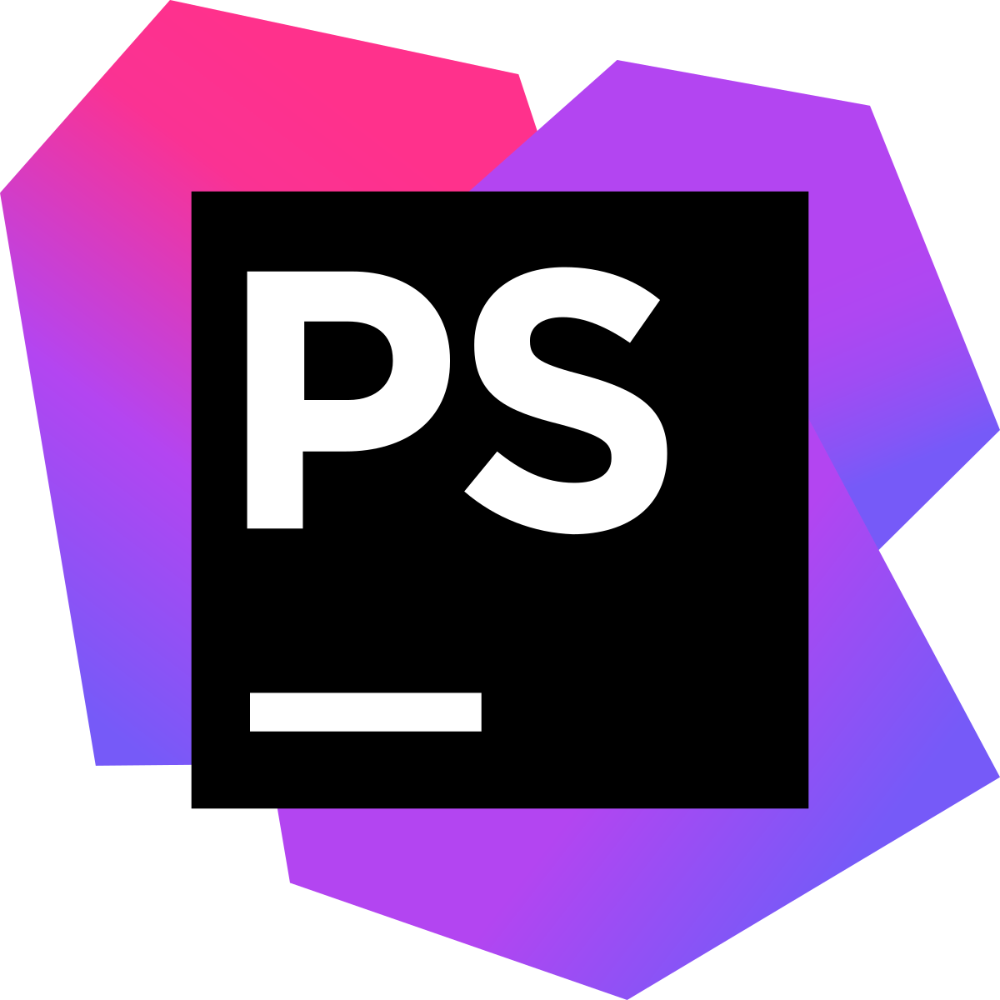

# IoT Networking

Homework:
1. Apply for a student license for JetBrains Software: https://www.jetbrains.com/shop/eform/students
2. Download and Install PhpStorm IDE

<table>
  <tbody>
    <tr>
      <td style="width: 25%; border: none;"></td>
      <td style="border: none;">We will be using PhpStorm Integrated Development Environment by JetBrains for working with our Network Server. Please apply for a **FREE** Professiona version of PhpStorm.</td>
    </tr>
  </tbody>
</table>

