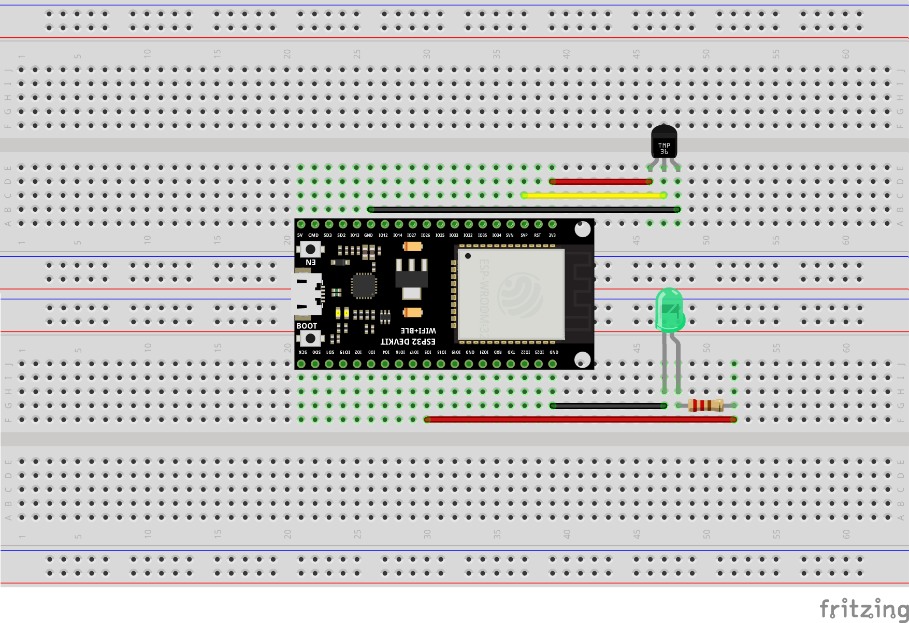
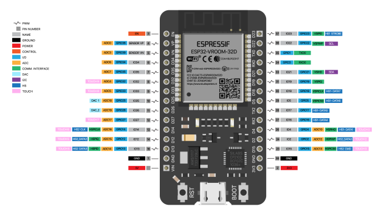

# IoT Networking

Homework for this week Sept 22 - 29:
1. Open PhpStorm
2. Double-Click the file **index_unauth_unencrypt.php** to view its contents.
3. Now open Arduino IDE and open the program folder **MQTT_Basics_IoTNetworking**.
4. From the **MQTT_Basics_IoTNetworking** folder open functions.h
5. Compare the two files side-by-side.
6. On or near lines 97 and 107 of **index_unauth_unencrypt.php** are two places that you need to 
   replace my first (Bryan) and last (Cage) name with your first and last name. Make sure that the 
   punctuation (capitalization) match your first and last names in the **functions.h** file around 
   line 95.
   
   ### Excerpt from index_unauth_unencript.php 
   Replace my first and last name with yours on lines 97 and 107
   
   ```javascript

    $(function () {
        $('.Toggle_Switch').change(function () {
            if ($(this).prop('checked')) {
                console.log("Publishing to mqttSubscribe/: Message = true");
                let message = new Paho.MQTT.Message("{\"firstName\":\"Bryan\", \"lastName\":\"Cage\", \"message\":true}");
                console.log(message.payloadString);
                message.destinationName = "mqttSubscribe/";
                try {
                    client.send(message);
                } catch (error) {
                    console.log("Not Connected");
                }
            } else {
                console.log("Publishing to mqttSubscribe/: Message = false");
                let message = new Paho.MQTT.Message("{\"firstName\":\"Bryan\", \"lastName\":\"Cage\", \"message\":false}");
                console.log(message.payloadString);
                message.destinationName = "mqttSubscribe/";
                try {
                    client.send(message);
                } catch (error) {
                    console.log("Not Connected");
                }
            }
        });
    })
    ```
### Excerpt from functions.h in Arduino Program Folder MQTT_Basics_IoTNetworking
```c

if ((String)firstName == "Bryan" and (String)lastName == "Cage") {
```


Homework:
1. Apply for a student license for JetBrains Software: https://www.jetbrains.com/shop/eform/students
2. Download and Install PhpStorm IDE: https://www.jetbrains.com/phpstorm/download/#section=windows
3. Download and Install MQTT.fx software: http://www.jensd.de/apps/mqttfx/1.7.1/</br></br>
   a. mqttfx-1.7.1-macos.dmg  2018-09-28 14:27   55M  (**Mac Users**)</br>
   b. mqttfx-1.7.1-windows..> 2018-09-28 14:27   51M  (**Windows Users**)</br>

We will be using PhpStorm Integrated Development Environment for creating and working with our server files and directories. Please apply for a **FREE** Professional version of PhpStorm, download it and install onto your laptop.

We will be using MQTT.fx software to **Subscribe** and **Publish** MQTT Packets for monitoring and testing.

### ESP32 Wiring for TMP36 Temperature Sensor (GPIO36 - VP or SVP) and LED (GPIO5)

1. Two Breadboards
2. One 220 Ohm resistor
3. ESP32 Dev Board
4. One TMP36 Temperature Sensor
5. One Light Emitting Diode (LED) of your color choice





### Monitoring Temperature with the TMP36
```c
#include <driver/adc.h>

float voltage;
double tempC;
double tempF;

void setup() {
  Serial.begin(115200);
}

void loop() {
  // put your main code here, to run repeatedly:
  getTemp();
}

// Custom Function
void getTemp() {

  // Read Temperature from ADC
  adc1_config_width(ADC_WIDTH_BIT_12);
  adc1_config_channel_atten( ADC1_CHANNEL_0, ADC_ATTEN_0db );
  int raw_val = adc1_get_raw(ADC1_CHANNEL_0); // GPIO 36 - SP; On some boards it is screen printed SVP
  
  voltage = raw_val/4096.0;

  // Convert voltage reading to temperature in °C
  tempC = (voltage - 0.5) * 100; // Use with ESP32
  
  // Convert °C to °F
  tempF = (tempC * 9.0 / 5.0) + 32.0;

  // Print to Serial Monitor for Debugging
  Serial.print("Temp F: ");
  Serial.println(tempF);
  Serial.print("Raw Reading: ");Serial.println(raw_val);
  Serial.print("Voltage: ");Serial.println(voltage);

  // Print Temperature every 5 seconds to Serial Monitor
  delay(5000);
}
```

### Sending and Receiving Data using Message Queuing Telemetry Transport or MQTT

MQTT is an OASIS standard messaging protocol for the Internet of Things (IoT). It is designed as an extremely lightweight publish/subscribe messaging transport that is ideal for connecting remote devices with a small code footprint and minimal network bandwidth. MQTT today is used in a wide variety of industries, such as automotive, manufacturing, telecommunications, oil and gas, etc. 
